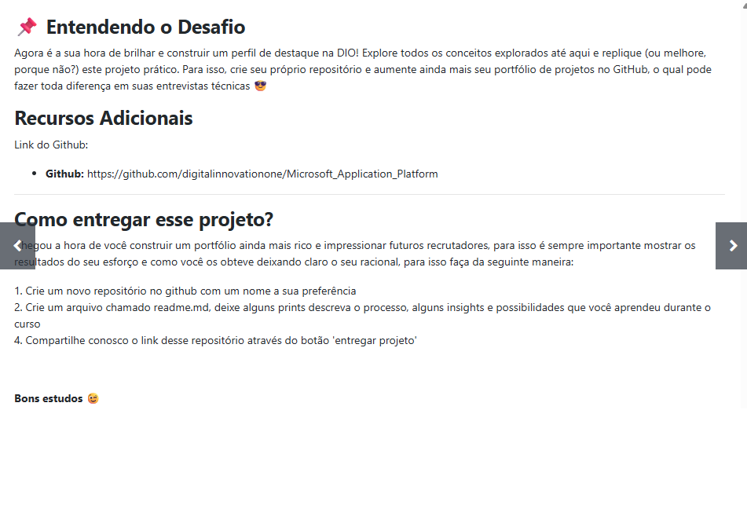
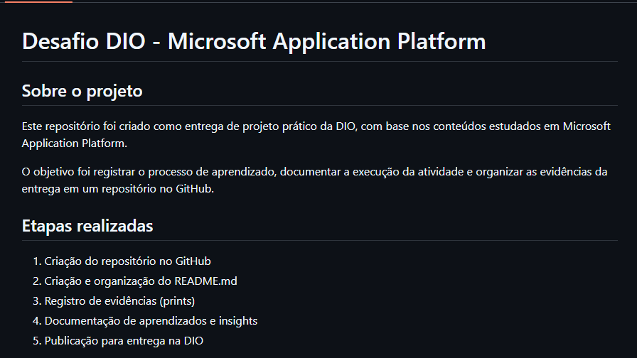

# Desafio DIO - Microsoft Application Platform

## Sobre o projeto

Este repositório foi criado como entrega de projeto prático da DIO, com base nos conteúdos estudados em Microsoft Application Platform.

O objetivo foi registrar o processo de aprendizado, documentar a execução da atividade e organizar as evidências da entrega em um repositório no GitHub.

## Etapas realizadas

1. Criação do repositório no GitHub
2. Criação e organização do README.md
3. Registro de evidências (prints)
4. Documentação de aprendizados e insights
5. Publicação para entrega na DIO

## Evidências (prints)

### Print 1 - Página do desafio na DIO

### Print 2 - Repositório no GitHub

### Print 3 - README do projeto no GitHub

## Aprendizados

Este desafio reforçou a importância de transformar teoria em prática, organizar documentação técnica e apresentar projetos de forma clara no GitHub, contribuindo para a construção de portfólio.

## Insights e possibilidades de melhoria

Como próximos passos, posso enriquecer a documentação com mais detalhes técnicos, adicionar novas evidências e relacionar os conceitos estudados com cenários reais de uso.

## Conclusão

A atividade foi importante para consolidar conhecimentos e fortalecer meu portfólio, unindo prática, organização e documentação em uma entrega objetiva.

## Referência

Repositório base da DIO:
https://github.com/digitalinnovationone/Microsoft_Application_Platform

## Autor

Cláudio Santos  
GitHub: https://github.com/cmosantos
